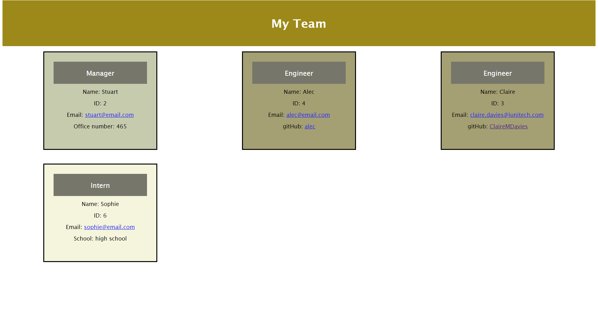

# Profile Generator 
 
## Description
Creating an application that would allow a user to input details of a team, such as manager, engineer, and intern, and display their details on a webpage.  Following a TDD approach.  

## Table of Contents
  - [Profile Generator](#profile-generator--)
  - [Description](#description)
  - [Table of Contents](#table-of-contents)
  - [Installation](#installation)
  - [Usage](#usage)
  - [License](#license)
  - [Contributors](#contributors)
  - [Technologies Used](#technologies-used)
  - [Future versions](#future-versions)

## Installation
Initiate the app by opening the terminal, and running npm install, followed by node index.js

## Usage
The following video shows the application in action.

After going through the installation process, you need to answer the questions posed in the terminal.  Once completed, these will be added into an html template, and written to the output.html in the dist file, where you will be able to see the dynamically created html file.  

By running npm run test, you can check the functionality of the code provided. 

A screenshot of the rendered html page is shown below.

## License
License with MIT

## Contributors
This app is the sole work of [Claire](https://github.com/ClaireMDavies)

## Technologies Used
- HTML
- CSS
- Javascript
- node.js
- inquirer npm
- jest npm
  

## Future versions
Given enough time I would have created more robust questions within inquirer, and worked out how to ensure the information inputted via inquirer was correct, such as the office number only able to be a number, and the email address being a working email address.

Also looking at how to present the data, displaying all roles in groups, and ordering it alphabetically, so making it easier to find the details of the person you need.

